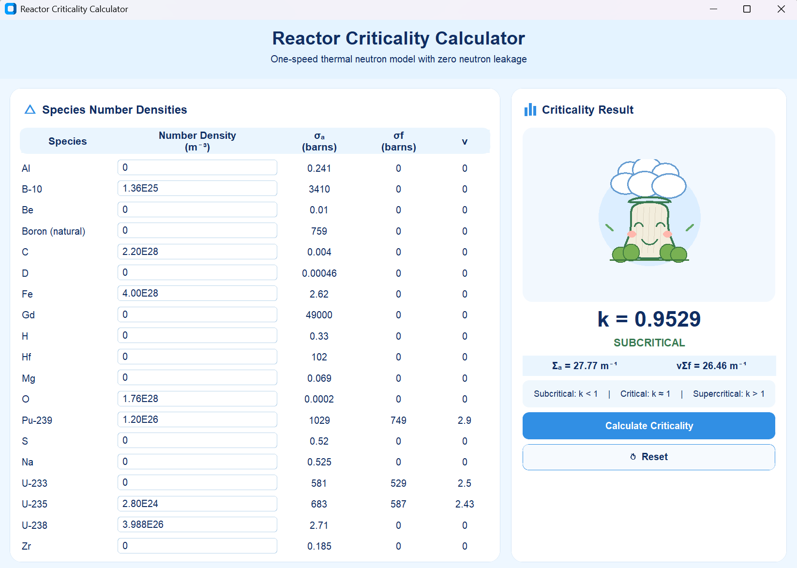

# Reactor Criticality Calculator

A Python application for calculating the neutron multiplication factor of a reactor mixture using a one-speed, zero-neutron-leakage model.

The user specifies the number density of each species, while thermal neutron cross-section data are loaded from a JSON data file. The application calculates the neutron multiplication factor and classifies the system as subcritical, critical, or supercritical.

# Model

For each species, the macroscopic absorption cross section is calculated as:

$$\Sigma_{a,i} = N_i \sigma_{a,i}$$

The neutron-production contribution is calculated as:

$$\nu\Sigma_{f,i} = \nu_i N_i \sigma_{f,i}$$

The total macroscopic absorption and neutron-production cross sections are:

$$\Sigma_a = \sum_i N_i \sigma_{a,i}$$

$$\nu\Sigma_f = \sum_i \nu_i N_i \sigma_{f,i}$$

The neutron multiplication factor is then calculated as:

$$k = \frac{\nu\Sigma_f}{\Sigma_a} = \frac{\sum_i \nu_i N_i \sigma_{f,i}}{\sum_i N_i \sigma_{a,i}}$$

where:

- $N_i$ is the number density of species $i$
- $\sigma_{a,i}$ is the microscopic absorption cross section
- $\sigma_{f,i}$ is the microscopic fission cross section
- $\nu_i$ is the average number of neutrons produced per fission

The calculated multiplication factor is classified as:

- **Subcritical:** $k < 1$
- **Critical:** $k \approx 1$
- **Supercritical:** $k > 1$

# Example Output

The graphical interface allows the number density of each species to be entered directly. The corresponding thermal neutron cross-section data are displayed alongside each species.

After calculation, the interface displays the neutron multiplication factor, total macroscopic absorption cross section, total neutron-production cross section, and criticality classification.



# Assumptions

The model assumes:

- One-speed thermal neutrons
- Zero neutron leakage
- Homogeneous material composition
- Constant microscopic cross sections
- No spatial or energy dependence of the neutron flux

As neutron leakage is neglected, the calculated multiplication factor represents an idealised infinite-medium approximation rather than the effective multiplication factor of a finite reactor.

# Nuclear Data

Thermal neutron data are stored separately in `data/nuclear_data.json`. For each species, the data file contains:

- Microscopic absorption cross section, $\sigma_a$
- Microscopic fission cross section, $\sigma_f$
- Average number of neutrons produced per fission, $\nu$

Microscopic cross sections are stored in barns and converted to square metres during the calculation using:

$$1\ \text{barn} = 10^{-28}\ \text{m}^2$$

# Project Structure

```text
Reactor-Criticality-Calculator/
├── data/
│   └── nuclear_data.json
├── functional_tests/
│   ├── __init__.py
│   ├── test_cases.json
│   └── test_functional.py
├── tests/
│   ├── __init__.py
│   └── test_calculations.py
├── images/
│   └── example_output.png
├── calculations.py
├── gui.py
├── main.py
├── variables.py
├── DERIVATIONS.md
├── README.md
├── requirements.txt
└── .gitignore
```

# Running the Calculator

Install the required dependencies:

```bash
pip install -r requirements.txt
```

Run the application:

```bash
python main.py
```

Enter the number density of the required species in m⁻³ and select **Calculate Criticality** to evaluate the system.

# Testing

The project includes unit and functional tests to verify the numerical implementation.

Unit tests assess individual calculation functions, including cross-section conversion, macroscopic cross-section calculations, multiplication factor calculation, criticality classification, and input validation.

JSON-driven functional tests assess the complete calculation workflow using synthetic test data for subcritical, critical, and supercritical cases.

Run the complete test suite using:

```bash
python -m pytest -v
```

# Further Details

A more detailed derivation of the equations implemented by the calculator is provided in [`DERIVATIONS.md`](DERIVATIONS.md).